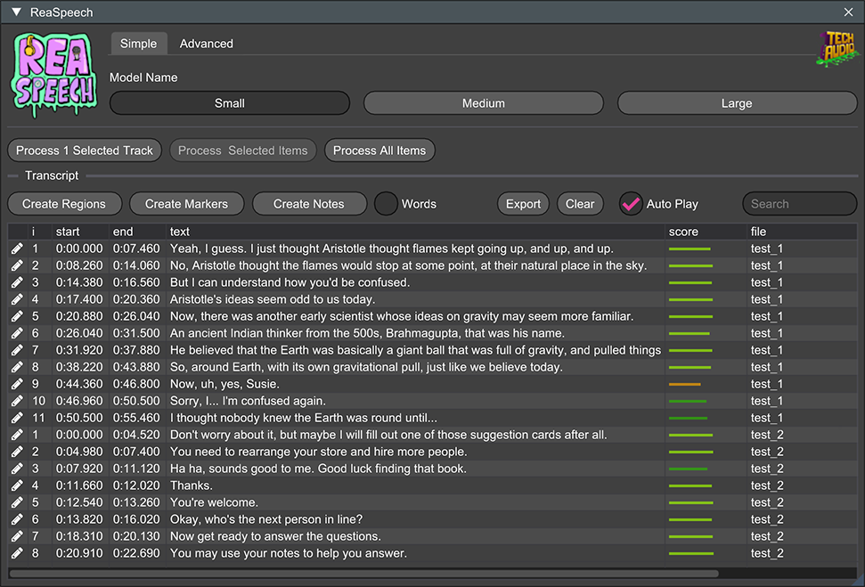

# ReaSpeech

### Painless speech-to-transcript inside of REAPER
ReaSpeech is a REAScript frontend that will take your project's media items and run them through a docker-hosted whisper backend, building a searchable, project-marker based index of the resulting transcription. That's right - not only do you reap (zing!) the benefits of a staff of transcribers, but you get to add "familiar with Docker" to your resume.

# Quick Usage

* Install [Docker](https://www.docker.com/)
* Run the [Docker image](https://hub.docker.com/r/techaudiodoc/reaspeech)
* Navigate to [localhost:9000](http://localhost:9000/)

## Docker Commands

### CPU

    docker run -d -p 9000:9000 techaudiodoc/reaspeech:latest

### GPU (currently Windows/NVIDIA only)

    docker run -d --gpus all -p 9000:9000 techaudiodoc/reaspeech:latest-gpu

For more detailed instructions, see [Docker Usage](docs/docker.md)

# Documentation

* [Docker Usage](docs/docker.md)
* [Running Outside of Docker](docs/nodocker.md)
* [Contributing](docs/CONTRIBUTING.md)
* [Development](docs/development.md)

# Credits

## ReaSpeech Team

* [Dave Benjamin](https://github.com/ramen)
* [Jason Nanna](https://github.com/smrl)
* [Kyle Vande Slunt](https://github.com/kvande-standingwave)
* [Michael DeFreitas](https://github.com/mikeylove)
* [Roel Sanchez](https://github.com/roelsan)

## Third-Party Software

ReaSpeech's initial web service and Docker setup were based on the [Whisper ASR Webservice](https://github.com/ahmetoner/whisper-asr-webservice) project.

Transcription is provided by the [Faster Whisper](https://github.com/SYSTRAN/faster-whisper) library.

ReaSpeech uses [ReaImGui](https://github.com/cfillion/reaimgui) by Christian Fillion for its user interface toolkit.

# Licensing

ReaSpeech is licensed under the terms of the
[GPLv3](https://www.gnu.org/licenses/gpl-3.0.en.html).
Portions are derived from the
[whisper-asr-webservice](https://github.com/ahmetoner/whisper-asr-webservice)
project, which is MIT-licensed. All source files in this repository should be
considered GPL-licensed unless otherwise specified.
